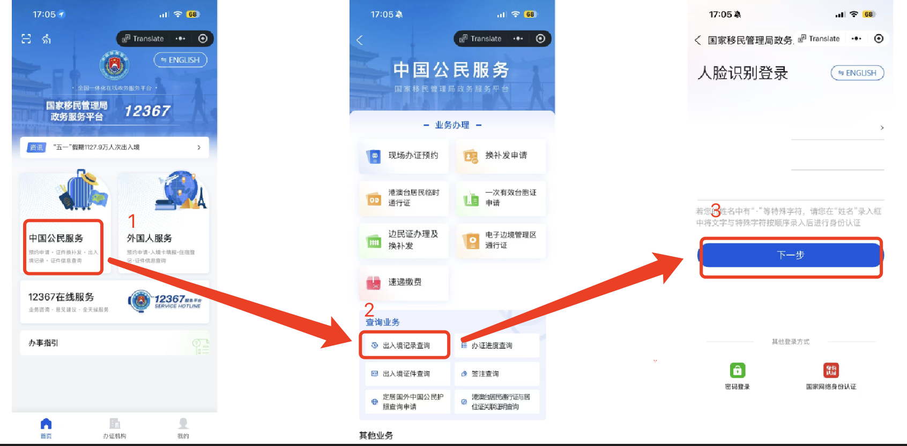
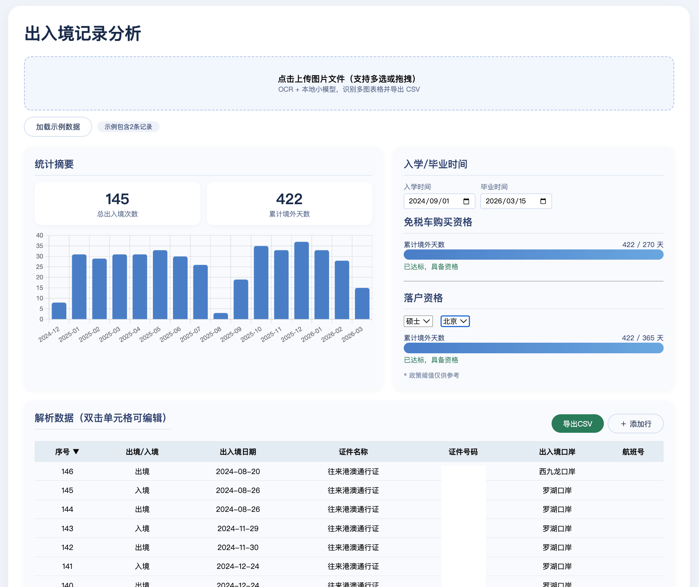

# 留学生出入境计算器（多图识别版）

## 为什么做这个程序

留学生办理免税车、落户等手续时，需要统计累计出境/入境天数。目前没有现成的工具能够从出入境记录截图中自动提取表格并计算累积居留时间，且这些记录涉及个人身份信息，不适合上传到任何在线服务处理。

因此开发了这款**完全本地运行**的工具：

- 图片不上传任何服务器，全部在本地处理
- 基于 PaddleOCR 离线识别，不需联网
- 支持多张图片批量识别，自动合并数据
- 自动计算累计境外居留天数，评估免税车和落户资格
- 数据可导出为 CSV，方便提交给相关部门

---

## 如何获取出入境记录



*（上图为获取出入境记录的界面）*

---

## 功能说明



*（上图为本程序用户界面）*

### ① 上传区域

- **点击上传**：点击虚线框区域，在弹出的文件选择器中选取一张或多张图片
- **拖拽上传**：直接将图片文件或文件夹拖拽到虚线框内
- **支持格式**：PNG / JPG / JPEG

上传后自动开始 OCR 识别，进度条显示处理进度。识别完成后，数据自动填入下方表格。

### ② 加载示例数据

点击「加载示例数据」按钮，填充两条示例记录用于测试和预览功能，不依赖图片上传。

### ③ 操作按钮区

| 按钮 | 作用 |
|------|------|
| **导出 CSV** | 将当前所有数据导出为 UTF-8 BOM 格式的 CSV 文件，含表头（序号、出境/入境、出入境日期、证件名称、证件号码、出入境口岸、航班号），可直接用 Excel / WPS 打开 |
| **＋ 添加行** | 在表格末尾添加一行空白记录，用于手动补充缺失数据 |

### ④ 数据表格

识别结果以可编辑表格形式展示：

- **字段列**：序号、出境/入境、出入境日期、证件名称、证件号码、出入境口岸、航班号
- **双击编辑**：任意单元格双击后直接修改内容，修改后自动重新计算统计
- **排序切换**：点击「出入境日期」表头，在降序 ▼（最新在前）和升序 ▲（最旧在前）间切换；日期相同时按序号（seq）排序
- **批量合并**：多张图片识别出的数据会自动合并到同一张表中

### ⑤ 统计摘要

| 指标 | 说明 |
|------|------|
| **总出入境次数** | 当前表格中的记录总数 |
| **累计境外天数** | 根据出入境日期配对计算的总境外居留天数 |

#### 境外天数计算规则

每两行记录配为一对，规则如下：

1. 系统按顺序两两配对：第 1 条 **出境** 和第 2 条 **入境** 为一对，依此类推
2. 每对中识别出入境和出境：`境外天数 = 入境日期 − 出境日期 + 1`
3. 同天往返：入境和出境为同一天时，计 **1 天**
4. 奇数条处理：若总记录数为奇数，最后一条未配对的入境记录，从该日期累计到**今天**
5. 将所有对数的天数相加，得到累计境外总天数

### ⑥ 每月境外居留时长（柱状图）

将每条出入境记录的境外居留天数按天拆分到各个月份，展示**每月境外居留天数**的分布情况。有助于直观了解哪些月份在境外停留较多。

### ⑦ 免税车购买资格

留学生回国购买免税车需满足**累计境外天数 ≥ 270 天**的要求：

- 进度条实时显示当前累计天数与目标的比例
- 达标后显示「已达标，具备资格」
- 未达标时显示还需要的天数差额

### ⑧ 落户资格

根据选择城市和学历，评估是否满足落户所需的境外居留天数门槛：

| 城市 | 本科/硕士/博士门槛 |
|------|-------------------|
| 上海 | 360 天 |
| 北京 | 365 天 |
| 广州 | 180 天 |
| 深圳 | 180 天 |
| 杭州 | 180 天 |

- 可通过下拉菜单切换城市和学历
- 进度条实时显示当前累计天数与目标门槛的比例

---

## 安装步骤

### 1. 创建虚拟环境

```bash
python3 -m venv venv
```

### 2. 激活虚拟环境

```bash
source venv/bin/activate
```

确认环境已激活：

```bash
which python
pip --version
```

### 3. 安装依赖

```bash
# 升级 pip
python -m pip install --upgrade pip

# 安装 PaddlePaddle（CPU 版本，兼容 M1）
python -m pip install paddlepaddle==3.3.1 -i https://pypi.tuna.tsinghua.edu.cn/simple

# 安装 OCR 及 Web 服务
python -m pip install paddleocr fastapi uvicorn python-multipart

# 如遇依赖冲突，安装以下基础库
python -m pip install opencv-python-headless pillow
```

> **首次启动时**，PaddleOCR 会自动下载约 150 MB 的模型文件（PP-OCRv6 检测/识别、文档去扭曲、方向分类），保存在项目目录下的 `.paddlex/` 中。下载只需一次，后续离线可用。

### 4. 启动服务

```bash
python app.py
```

启动后终端显示：
```
INFO:     Started server process [xxx]
INFO:     Waiting for application startup.
INFO:     Application startup complete.
INFO:     Uvicorn running on http://127.0.0.1:8004
```

### 5. 打开页面

浏览器访问：

```
http://127.0.0.1:8004/
```

---

## 项目结构

```
.
├── app.py            # 后端：FastAPI + PaddleOCR 推理服务
├── main.js           # 前端：数据展示、图表、统计逻辑
├── index.html        # 前端：页面结构
├── style.css         # 前端：样式表
├── README.md         # 本文件
├── instruction.png   # 界面说明图
├── example.png       # 示例图片（可上传测试）
└── .paddlex/         # PaddleX 模型缓存（自动下载）
```

## 常见问题

**Q：识别结果为空？**
A：检查图片是否为标准的出入境记录表格截图。首次使用时请确保网络畅通，让模型下载完成。

**Q：识别出的字段有误？**
A：表格中的数据可双击单元格直接编辑修改。

**Q：端口 8004 被占用？**
A：编辑 `app.py` 最后一行，将 `port=8004` 改为其他端口。

**Q：如何关闭服务？**
A：在终端按 `Ctrl + C` 即可停止。
